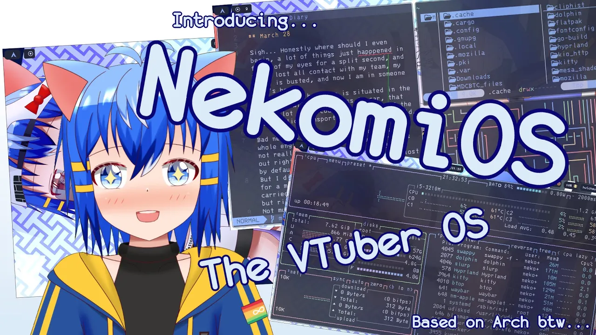

# NekomiOS-dots

## Seen on YouTube! (Click photo for video)

## Dot files and Usage

Dot files for "NekomiOS" which is a rice based on Arch Linux. 
They are meant to configure packages and other software, you can use them by dragging them into the corresponding directory or copying it. 
If you like the base of my rice and wanted to add your own spice to it, you can copy and modify some parts for your own use.

## Inspiration

I have been eyeing on the Linux community for a while til one day when a professor encouraged me to try it out.
Given I am an artist that just to happen to do a STEM degree, and of course inspired by [r/unixporn](https://www.reddit.com/r/unixporn/), \
makes me wanted to try to do my own custom rice.
Now, not only I have gained knowledge as I fall into this rabbit hole, I am able to freely customize my computer with the freedom of open source.

## License

The files and scripts in this repository are licensed under the MIT License, 
which is a very permissive license allowing you to use, modify, copy, distribute, sell, give away, etc. 
the software. In other words, do what you want with it. The only requirement with the MIT License is that the license and copyright notice must be provided with the software.

## Acknowledgements

People that had helped me through this journey

[SomeOrdinaryGamers](https://www.youtube.com/@SomeOrdinaryGamers),
[Linus Tech Tips](https://www.youtube.com/@LinusTechTips),
[The Linux Cast](https://www.youtube.com/@TheLinuxCast),
[The Linux Experiment](https://www.youtube.com/@TheLinuxEXP),
[DistroTube](https://www.youtube.com/@DistroTube),
[Chris Titus Tech](https://www.youtube.com/@ChrisTitusTech),
[Brodie Robertson](https://www.youtube.com/@BrodieRobertson),
[r/unixporn](https://www.reddit.com/r/unixporn/),
a_usr on discord

and of course
[My Computing Professor](https://profiles.imperial.ac.uk/c.cantwell)

## NixOS Config (Video soon)
[I have taken the Nix Pill](https://github.com/Nekomi-ch/NekomiNix)
